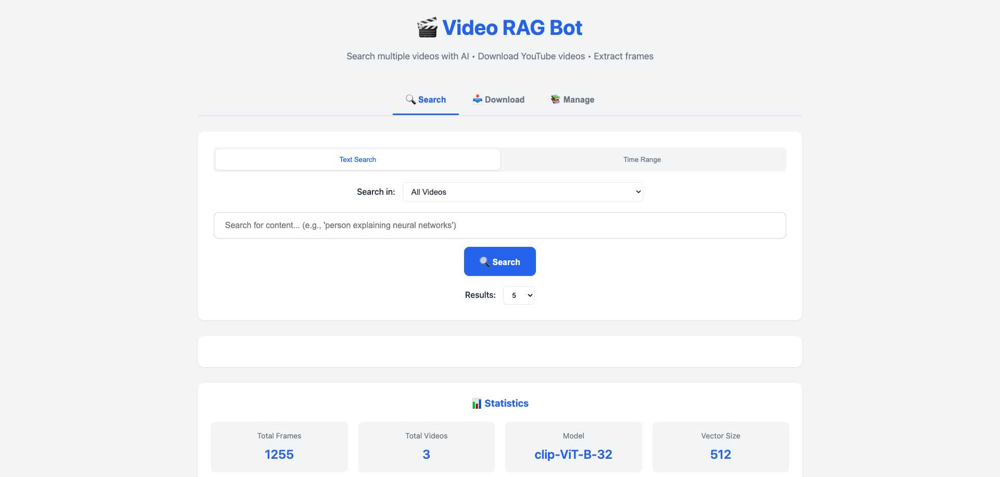
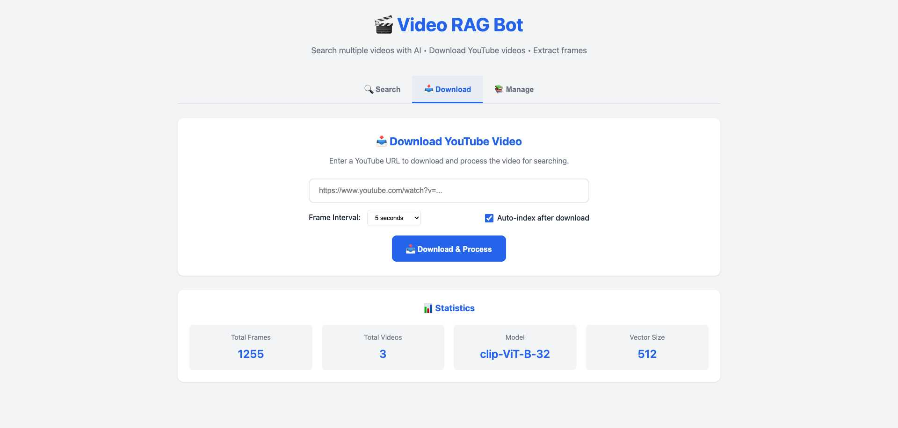
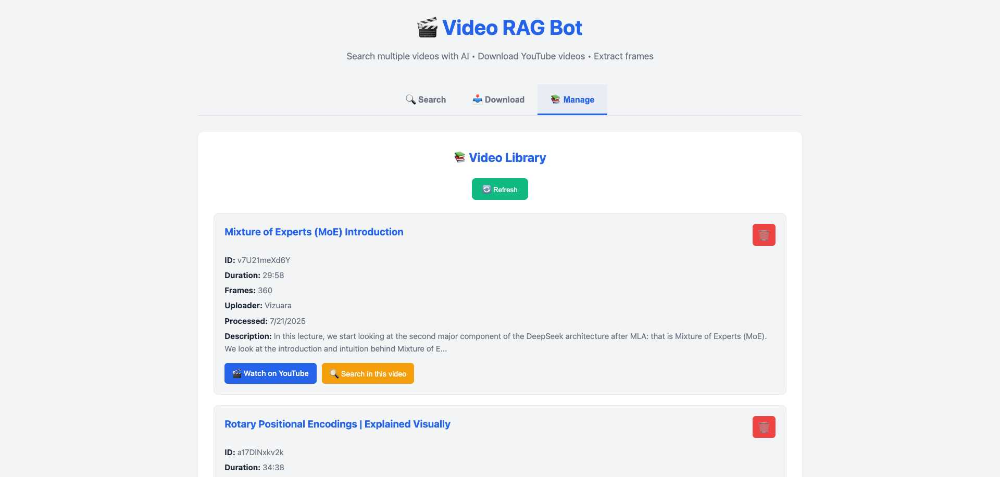
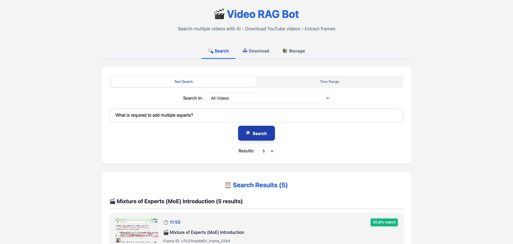

# Building a Multi-Modal Video Search Engine with CLIP and Qdrant

> **🎓 Educational Purpose**: This project is designed for **learning and understanding Multimodal RAG (Retrieval-Augmented Generation) pipelines**. It demonstrates how to combine computer vision, natural language processing, and vector databases to create intelligent search systems that work across different data modalities (text, images, video). Perfect for students, researchers, and developers wanting to understand modern AI architectures.

## 🎬 Transform Any Video into a Searchable Knowledge Base

Have you ever wanted to find that specific moment in a video where someone explained a concept? Or search through hours of video content as easily as searching text? This educational project shows you how to build a production-ready video search engine that lets you query video content using natural language or even images.


## 📸 Live Demo


*Beautiful web interface with multi-video search, YouTube downloading, and real-time statistics*

## 🚀 What We're Building

We're creating a **Video RAG (Retrieval-Augmented Generation)** system that:

- 📥 Downloads YouTube videos automatically
- 📸 Extracts frames from videos at regular intervals
- 🧠 Generates semantic embeddings using OpenAI's CLIP model
- 💾 Stores embeddings in Qdrant vector database
- 🔍 Enables text-to-video search ("find frames with whiteboards")
- 🖼️ Supports image similarity search
- ⏱️ Allows time-based queries
- 🎬 Supports multiple videos in one searchable collection
- 🔗 Generates direct YouTube timestamps for results
- 🌐 Includes a beautiful web interface for easy searching
- 🛡️ **Robust Error Handling**: Advanced 403/bot detection prevention
- 🗑️ **Smart Storage Management**: Auto-deletes videos after processing (95% space savings)
- 🔄 **Auto-Reload Development**: Server automatically restarts on code changes
- 🧪 **Connection Testing**: Built-in YouTube connectivity diagnostics
- 📱 **Responsive UI**: Works seamlessly on desktop and mobile devices
- ⚡ **Performance Optimized**: Multi-strategy downloads with automatic fallbacks

## 📋 Prerequisites

Before we start, make sure you have:

- Python 3.8+
- Docker and Docker Compose
- FFmpeg (for video processing)
- 4GB+ free disk space

## 🛠️ Quick Start

### 1. Clone and Setup

```bash
git clone <your-repo>
cd video-rag
pip install -r requirements.txt
```

### 2. Start Qdrant Vector Database

```bash
docker-compose up -d
```

This launches Qdrant on `http://localhost:6333`. You can view the dashboard at `http://localhost:6333/dashboard`.

### 3. Download & Process Videos

```bash
# Download YouTube video and auto-index
python main.py download "https://youtu.be/VIDEO_ID" --auto-index

# Or download multiple videos
python main.py download "https://youtu.be/VIDEO_ID_1" --auto-index
python main.py download "https://youtu.be/VIDEO_ID_2" --auto-index
```


*Easy-to-use web interface for downloading YouTube videos with configurable frame extraction*


*Comprehensive video library management with metadata, search shortcuts, and deletion options*

**Alternative**: Manual video preparation (if needed):

```bash
# Extract frames (1 frame every 5 seconds)
mkdir screenshots
ffmpeg -i video.mp4 -vf "fps=0.2" screenshots/frame_%04d.jpg

# Generate metadata
python create_metadata.py
```

### 4. Index Video Frames

```bash
python main.py index
```

This will:
- Load video frame metadata
- Generate CLIP embeddings for each frame
- Store them in Qdrant vector database

### 5. Search Your Video!

#### Option A: Web Interface (Recommended) 🌐

```bash
# Start the web server
python app.py
```

Then open http://localhost:7777 in your browser for a beautiful search interface!


*Intelligent semantic search finds relevant frames across multiple videos with timestamp links*

#### Option B: Command Line

```bash
# Download videos
python main.py download "https://youtu.be/VIDEO_ID" --auto-index

# Text search (all videos)
python main.py query --text "person explaining neural networks"

# Search specific video
python main.py query --text "neural networks" --video-id VIDEO_ID

# Image similarity
python main.py query --image screenshots/frame_0100.jpg

# Time range search
python main.py query --time-range 5:00 10:00

# List all videos
python main.py list videos
```

## 🎯 Recent Enhancements & Features

### 🛡️ **Advanced YouTube Download Protection**

Our system includes enterprise-grade protection against YouTube's anti-bot measures:

```bash
# Test YouTube connectivity before downloading
python main.py test

# Output:
🧪 Testing YouTube connectivity...
✅ YouTube connection is working properly  
🎬 Test video: Rick Astley - Never Gonna Give You Up (Official Video)
🎉 You can now download YouTube videos!
```

**Multi-Strategy Download System:**
- **Strategy 1**: Standard download with browser-like headers
- **Strategy 2**: Automatic fallback with conservative settings  
- **Built-in Retries**: Handles 403 Forbidden errors intelligently
- **Smart Error Messages**: Guides users on how to resolve issues

### 🗑️ **Intelligent Storage Management**

**Automatic Video Cleanup** (saves ~95% disk space):
```python
# After frame extraction:
🗑️ Deleted video file: video.webm (187.3 MB saved)
✅ Kept: 416 frame screenshots + metadata (~5 MB)
```

**User Control Options:**
- ✅ **Default**: Auto-delete videos after processing (recommended)
- 🔧 **Optional**: Keep video files (uncheck "Keep video file" in UI)
- 📊 **Space Monitoring**: Real-time storage usage reporting

### 🔄 **Development Experience**

**Auto-Reload Server:**
```python
# Server automatically restarts when you modify code
INFO: WatchFiles detected changes in 'app.py'. Reloading...
```

**Dynamic UI Updates:**
- ✅ Real-time video deletion from interface
- ✅ Instant statistics updates
- ✅ No manual refresh needed
- ✅ Complete file cleanup (database + physical files)

### 🧪 **Testing & Diagnostics**

**Built-in Connectivity Testing:**
```bash
python main.py test  # Test YouTube access
python main.py list stats  # View collection statistics  
python main.py list videos  # See all processed videos
```

**Comprehensive Error Handling:**
- 🔍 **403 Forbidden**: "YouTube blocked access - try again in a few minutes"
- 🔍 **404 Not Found**: "Video not found - check the URL"  
- 🔍 **Private Videos**: "Video is private and cannot be downloaded"
- 🔍 **Live Streams**: "Cannot download live streams"

### 🛠️ **Troubleshooting Common Issues**

**YouTube 403 Forbidden Errors:**
```bash
# 1. Update yt-dlp to latest version
pip install --upgrade yt-dlp

# 2. Test connectivity first
python main.py test

# 3. Wait a few minutes and try again (rate limiting)
# 4. Try a different video URL
```

**Video Download Fails:**
```bash
# Check video availability
- Is the video public?
- Does it require YouTube Premium?
- Is it geo-restricted in your region?
- Is it a live stream? (not supported)
```

**Out of Disk Space:**
```bash
# Monitor space usage
du -sh video-downloads/  # Check download directory size
python main.py list stats  # View collection statistics

# Enable auto-cleanup (default)
✅ Keep "Delete video files" enabled in UI
```

**Slow Processing:**
```bash
# Optimize for your hardware
- GPU: Install torch with CUDA support
- CPU: Reduce batch size in config.py
- RAM: Close other applications during indexing
```

**Web Interface Issues:**
```bash
# Common fixes
- Hard refresh: Ctrl+F5 (Windows) or Cmd+Shift+R (Mac)
- Check server logs for errors
- Restart server: python app.py
- Clear browser cache
```

## 🏗️ Architecture Deep Dive

### Project Structure

```
video-rag/
├── main.py              # CLI entry point
├── app.py               # Web interface
├── src/
│   ├── core/           # Base classes and config
│   ├── indexing/       # Frame indexing logic
│   ├── querying/       # Search functionality
│   └── utils/          # Helper functions
├── static/              # Web UI assets
│   ├── index.html      # Main page
│   ├── style.css       # Styling
│   └── script.js       # Interactivity
├── screenshots/         # Extracted video frames
├── video_metadata.json  # Frame timestamps
└── docker-compose.yml   # Qdrant setup
```

### How It Works

1. **Frame Extraction**: FFmpeg samples video at 0.2 fps (1 frame/5 seconds)
2. **Embedding Generation**: CLIP model converts frames to 512D vectors
3. **Vector Storage**: Qdrant stores embeddings with metadata
4. **Semantic Search**: CLIP encodes queries to match against stored vectors

## 🧠 The AI Model: CLIP (Contrastive Language-Image Pre-training)

### Why CLIP?

The Video RAG system is powered by **OpenAI's CLIP model**, specifically the `clip-ViT-B-32` variant. CLIP is revolutionary because it understands both text and images in the same 512-dimensional vector space, making it perfect for multi-modal video search.

### How CLIP Enables Magic

**Traditional Approach:** 
- Text search → keyword matching → limited results
- Image search → pixel comparison → no semantic understanding

**CLIP Approach:**
- Text search → semantic understanding → finds concepts, not just words
- Image search → visual concept matching → understands what's happening in frames
- **Cross-modal search:** Describe an image with text, find similar visual content

### Technical Specifications

- **Model**: `clip-ViT-B-32` (Vision Transformer with 32x32 patch size)
- **Vector Dimensions**: 512D embeddings
- **Training**: 400M image-text pairs from the internet
- **Languages**: Primarily English, with some multilingual capability
- **Performance**: Balances speed and accuracy for real-time search

### Real-World Examples

```python
# These all work because CLIP understands concepts:
"person drawing on whiteboard" → finds teaching moments
"neural network diagram" → locates architecture explanations  
"confused facial expression" → identifies difficult concepts
"hands gesturing" → discovers animated explanations
```

### Why Vision Transformer (ViT)?

The ViT-B-32 architecture:
- **Patches**: Breaks images into 32×32 pixel patches
- **Attention**: Uses transformer attention across visual patches
- **Efficiency**: Faster than convolutional approaches
- **Scalability**: Handles various image sizes and resolutions

This makes it ideal for processing video frames at scale while maintaining semantic understanding of visual content.

## 💡 Key Features Explained

### 1. Multi-Modal Search

CLIP's magic is that it understands both text and images in the same vector space:

```python
# Text → Vector → Similar Frames
results = engine.search_by_text("whiteboard with equations")

# Image → Vector → Similar Frames  
results = engine.search_by_image("reference_image.jpg")
```

### 2. Smart Time-Based Retrieval

```python
# Get all frames between 10:00 and 15:00
results = engine.search_by_time_range(600, 900)
```

### 3. YouTube Integration

Each result includes a clickable timestamp:
```
https://youtu.be/VIDEO_ID?t=325  # Jumps to 5:25
```

## 🎯 Real-World Use Cases

1. **Educational Content**: Find specific explanations in lecture videos
2. **Meeting Archives**: Search through recorded meetings
3. **Tutorial Navigation**: Jump to relevant sections in how-to videos
4. **Content Moderation**: Detect specific visual elements
5. **Video Summarization**: Extract key frames for highlights

## 🔧 Advanced Configuration

Edit `src/core/config.py` to customize:

```python
# Change embedding model
MODEL_NAME = "clip-ViT-L-14"  # Larger, more accurate

# Adjust processing
BATCH_SIZE = 64  # For GPUs
DEFAULT_SEARCH_LIMIT = 10

# Different frame extraction rate
# In FFmpeg: -vf "fps=0.5"  # 1 frame every 2 seconds
```

## 🚀 Performance Tips

1. **GPU Acceleration**: Install `torch` with CUDA for 10x faster indexing
2. **Batch Processing**: Increase `BATCH_SIZE` based on your RAM
3. **Optimize Storage**: Use Qdrant's quantization for large datasets
4. **Cache Embeddings**: Save computed embeddings for reuse

## 📊 Scaling to Production

For production deployments:

1. **Use Qdrant Cloud** for managed hosting
2. **Implement API** with FastAPI for web access
3. **Add Authentication** for secure access
4. **Enable Monitoring** with Prometheus/Grafana
5. **Use CDN** for frame serving

## 🚀 Next Steps & Future Enhancements

This educational project can be extended in many exciting directions:

### 🎵 **Audio Integration**
```python
# Add speech-to-text transcription
- Whisper integration for automatic subtitles
- Audio-based search: "find where they mention neural networks"
- Multi-language support with translation
- Speaker identification and diarization
```

### 🤖 **AI-Powered Enhancements**
```python
# Advanced AI capabilities
- Video summarization with GPT-4
- Automatic chapter generation
- Key moment detection
- Sentiment analysis of video content
- Object detection and tracking
```

### 📊 **Analytics & Insights**
```python
# Advanced analytics dashboard
- Search patterns analysis
- Popular content identification
- Usage statistics and heatmaps
- Performance metrics tracking
- A/B testing for search algorithms
```

### ☁️ **Production Deployment**
```python
# Scale to production
- Kubernetes deployment with Helm charts
- AWS/GCP cloud integration
- CDN for global frame serving
- Redis caching layer
- Horizontal scaling with load balancers
```

### 🔌 **API & Integrations**
```python
# External integrations
- REST API with OpenAPI documentation
- Webhook support for real-time updates
- Slack/Discord bot integration
- Browser extension for YouTube
- Mobile app with React Native
```

### 🛠️ **Advanced Features**
```python
# Power user features
- Custom embedding models (OpenCLIP, DINOv2)
- Facial recognition and person tracking
- Scene detection and transitions
- Playlist and collection management
- Collaborative annotations and bookmarks
```

### 🔬 **Research Extensions**
```python
# Academic research directions
- Multimodal fusion techniques
- Zero-shot video understanding
- Cross-lingual video search
- Temporal consistency in embeddings
- Federated learning across video collections
```

### 📱 **User Experience**
```python
# Enhanced UX/UI
- Real-time search suggestions
- Keyboard shortcuts and hotkeys
- Dark mode and accessibility features
- Video preview on hover
- Batch operations and bulk actions
```

## 🎓 Learning Outcomes

By exploring this project, you'll understand:

1. **Multimodal AI**: How to combine vision and language models
2. **Vector Databases**: Efficient similarity search at scale  
3. **Production MLOps**: Deployment, monitoring, and maintenance
4. **RAG Architectures**: Retrieval-augmented generation patterns
5. **Modern Web Development**: FastAPI, async programming, real-time UIs
6. **Video Processing**: FFmpeg, frame extraction, and media handling

## 🤝 Contributing

Feel free to open issues or submit PRs! Some beginner-friendly ideas:

### 🟢 **Easy (Good First Issues)**
- Add new video format support (.mov, .avi)
- Improve error messages and user feedback
- Add keyboard shortcuts to web interface
- Create video thumbnails for better previews

### 🟡 **Medium**
- Implement audio transcription with Whisper
- Add batch video processing
- Create export/import functionality for collections
- Build a browser extension

### 🔴 **Advanced**
- Integrate with cloud storage (S3, GCS)
- Add real-time video streaming support
- Implement federated search across instances
- Create custom embedding fine-tuning pipeline

## 📚 Resources

- [CLIP Paper](https://arxiv.org/abs/2103.00020)
- [Qdrant Documentation](https://qdrant.tech/documentation/)
- [Sentence Transformers](https://www.sbert.net/)

## 🙏 Acknowledgments

This educational project stands on the shoulders of giants. Built with amazing open-source projects:

### 🧠 **AI & ML**
- **OpenAI CLIP**: Revolutionary multimodal understanding
- **Sentence Transformers**: High-quality embeddings made easy
- **Hugging Face**: Transformers ecosystem and model hub

### 🗄️ **Data & Storage**
- **Qdrant**: High-performance vector database
- **Docker**: Containerization and deployment

### 🎬 **Video Processing**
- **FFmpeg**: The Swiss Army knife of video processing
- **yt-dlp**: Robust YouTube downloading with anti-bot protection

### 🌐 **Web & Backend**
- **FastAPI**: Modern, fast web framework with auto-documentation
- **Uvicorn**: Lightning-fast ASGI server with auto-reload
- **Playwright**: Reliable browser automation for testing

### 🎨 **Frontend**
- **Modern CSS**: Responsive design without frameworks
- **Vanilla JavaScript**: Clean, dependency-free interactivity

---

## 📖 **Educational Impact**

This project demonstrates real-world applications of:
- **Multimodal RAG pipelines** in production
- **Vector search** at scale with semantic understanding  
- **Modern MLOps** practices and deployment strategies
- **Full-stack AI application** development

Perfect for:
- 🎓 **Computer Science students** learning about AI systems
- 🔬 **Researchers** exploring multimodal applications
- 👩‍💻 **Developers** building production AI systems
- 🏫 **Educators** teaching modern AI architectures

---

**Happy Learning and Video Searching! 🎥🔍🎓**

*If this helped you understand Multimodal RAG, please ⭐ star the repo and share your learning journey!*